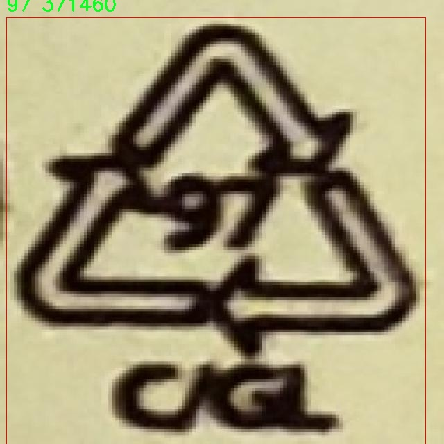

# 塑料瓶回收标志分级检测检测系统源码分享
 # [一条龙教学YOLOV8标注好的数据集一键训练_70+全套改进创新点发刊_Web前端展示]

### 1.研究背景与意义

项目参考[AAAI Association for the Advancement of Artificial Intelligence](https://gitee.com/qunmasj/projects)

项目来源[AACV Association for the Advancement of Computer Vision](https://kdocs.cn/l/cszuIiCKVNis)

研究背景与意义

随着全球塑料污染问题的日益严重，塑料瓶的回收与再利用成为了环境保护与可持续发展领域的重要议题。塑料瓶作为日常生活中最常见的塑料制品之一，其回收利用不仅能够有效减少环境污染，还能节约资源，降低生产成本。近年来，许多国家和地区开始实施塑料瓶回收政策，推动塑料瓶的分类回收和再处理。然而，现有的回收系统在标志识别和分类准确性方面仍存在诸多挑战，尤其是在多种类塑料瓶的标志分级检测中，传统的人工识别方法效率低下且容易出错。因此，开发一种高效、准确的塑料瓶回收标志分级检测系统显得尤为重要。

本研究旨在基于改进的YOLOv8（You Only Look Once version 8）模型，构建一个高效的塑料瓶回收标志分级检测系统。YOLOv8作为一种先进的目标检测算法，具备实时性强、精度高等优点，能够在复杂环境中快速识别和分类目标物体。通过对YOLOv8模型的改进，结合丰富的塑料瓶标志数据集，我们希望能够提升模型在多类别标志检测中的表现，尤其是在不同种类和形态的塑料瓶标志识别方面。

在本研究中，我们使用的数据集包含1500张图像，涵盖30个不同的类别。这些类别包括了多种塑料瓶的回收标志，如1、2、3、4、5等标志，代表了不同类型的塑料材料。通过对这些标志的有效识别与分类，能够为塑料瓶的回收提供准确的信息，从而提高回收效率。此外，数据集中涵盖的多样性和复杂性也为模型的训练提供了丰富的样本，有助于提高模型的泛化能力。

本研究的意义不仅在于技术层面的创新，更在于对环境保护的积极贡献。通过构建高效的塑料瓶回收标志分级检测系统，我们能够推动塑料瓶的分类回收，促进资源的循环利用，从而减少塑料废弃物对环境的影响。此外，该系统的成功应用还将为其他类型的废弃物分类检测提供借鉴，推动智能垃圾分类技术的发展，助力实现更广泛的可持续发展目标。

综上所述，基于改进YOLOv8的塑料瓶回收标志分级检测系统的研究，不仅具有重要的学术价值，也具有显著的社会意义。通过提升塑料瓶回收的效率与准确性，我们期待能够为环境保护贡献一份力量，推动社会对可持续发展的关注与实践。

### 2.图片演示


##### 注意：由于此博客编辑较早，上面“2.图片演示”和“3.视频演示”展示的系统图片或者视频可能为老版本，新版本在老版本的基础上升级如下：（实际效果以升级的新版本为准）

  （1）适配了YOLOV8的“目标检测”模型和“实例分割”模型，通过加载相应的权重（.pt）文件即可自适应加载模型。

  （2）支持“图片识别”、“视频识别”、“摄像头实时识别”三种识别模式。

  （3）支持“图片识别”、“视频识别”、“摄像头实时识别”三种识别结果保存导出，解决手动导出（容易卡顿出现爆内存）存在的问题，识别完自动保存结果并导出到tempDir中。

  （4）支持Web前端系统中的标题、背景图等自定义修改，后面提供修改教程。

  另外本项目提供训练的数据集和训练教程,暂不提供权重文件（best.pt）,需要您按照教程进行训练后实现图片演示和Web前端界面演示的效果。

### 3.视频演示

[3.1 视频演示](https://www.bilibili.com/video/BV17AsQeFEFv/)

### 4.数据集信息展示

##### 4.1 本项目数据集详细数据（类别数＆类别名）

nc: 30
names: ['1', '2', '20', '21', '22', '3', '4', '40', '41', '5', '51', '6', '60', '7', '70', '71', '72', '73', '74', '80', '81', '82', '87', '9', '90', '92', '95', '96', '97', '98']


##### 4.2 本项目数据集信息介绍

数据集信息展示

在塑料瓶回收标志分级检测系统的研究中，数据集“PlasticModel4”扮演了至关重要的角色。该数据集专为改进YOLOv8模型而设计，旨在提高塑料瓶回收标志的检测精度和效率。通过对多种塑料瓶标志的分类与识别，研究者们希望能够推动塑料回收行业的智能化发展，从而实现更高效的资源回收与再利用。

“PlasticModel4”数据集包含30个不同的类别，每个类别对应着特定的塑料瓶回收标志。这些类别的名称包括数字标识，从‘1’到‘98’的多个标志，涵盖了塑料瓶的不同类型和回收要求。这样的设计不仅便于模型的训练和识别，也为后续的回收标志分类提供了丰富的样本数据。具体来说，这些类别可能涉及到不同的塑料材质、回收标志的形状和颜色等特征，研究者通过这些特征来构建更加精准的检测模型。

数据集的构建过程注重了样本的多样性和代表性。为了确保模型在实际应用中的有效性，数据集中的样本涵盖了各种环境下的塑料瓶回收标志，包括城市、乡村、商业区等不同场景。这种多样化的样本来源使得模型能够在不同的实际应用场景中表现出良好的适应性。此外，数据集中的图像质量经过严格筛选，确保每一张图像都能清晰地展示标志的细节，便于模型进行特征提取和学习。

在数据集的标注过程中，研究团队采用了高标准的标注流程，确保每个标志的类别都得到了准确的标识。标注人员经过专业培训，熟悉每个类别的特征，确保标注的一致性和准确性。这种精细化的标注策略为后续的模型训练提供了坚实的基础，使得YOLOv8能够更有效地学习到各类标志的特征。

为了进一步增强数据集的实用性，研究团队还考虑到了数据增强技术的应用。通过对原始图像进行旋转、缩放、裁剪等处理，生成了更多的训练样本。这种数据增强不仅提高了模型的鲁棒性，也有效防止了过拟合现象的发生，使得模型在面对新样本时能够保持较高的检测精度。

总之，数据集“PlasticModel4”不仅为改进YOLOv8的塑料瓶回收标志分级检测系统提供了丰富的训练数据，也为后续的研究和应用奠定了坚实的基础。通过对多样化样本的精细标注和数据增强的应用，研究者们期望能够在塑料回收领域实现更高的智能化水平，推动可持续发展的目标。随着技术的不断进步，未来的塑料瓶回收将更加高效、智能，为环境保护贡献更多的力量。





### 5.全套项目环境部署视频教程（零基础手把手教学）

[5.1 环境部署教程链接（零基础手把手教学）](https://www.ixigua.com/7404473917358506534?logTag=c807d0cbc21c0ef59de5)


[5.2 安装Python虚拟环境创建和依赖库安装视频教程链接（零基础手把手教学）](https://www.ixigua.com/7404474678003106304?logTag=1f1041108cd1f708b01a)

### 6.手把手YOLOV8训练视频教程（零基础小白有手就能学会）

[6.1 手把手YOLOV8训练视频教程（零基础小白有手就能学会）](https://www.ixigua.com/7404477157818401292?logTag=d31a2dfd1983c9668658)

### 7.70+种全套YOLOV8创新点代码加载调参视频教程（一键加载写好的改进模型的配置文件）

[7.1 70+种全套YOLOV8创新点代码加载调参视频教程（一键加载写好的改进模型的配置文件）](https://www.ixigua.com/7404478314661806627?logTag=29066f8288e3f4eea3a4)

### 8.70+种全套YOLOV8创新点原理讲解（非科班也可以轻松写刊发刊，V10版本正在科研待更新）

由于篇幅限制，每个创新点的具体原理讲解就不一一展开，具体见下列网址中的创新点对应子项目的技术原理博客网址【Blog】：


[8.1 70+种全套YOLOV8创新点原理讲解链接](https://gitee.com/qunmasj/good)

### 9.系统功能展示（检测对象为举例，实际内容以本项目数据集为准）

图9.1.系统支持检测结果表格显示

  图9.2.系统支持置信度和IOU阈值手动调节

  图9.3.系统支持自定义加载权重文件best.pt(需要你通过步骤5中训练获得)

  图9.4.系统支持摄像头实时识别

  图9.5.系统支持图片识别

  图9.6.系统支持视频识别

  图9.7.系统支持识别结果文件自动保存

  图9.8.系统支持Excel导出检测结果数据


### 10.原始YOLOV8算法原理

原始YOLOv8算法原理

YOLOv8算法是由Ultralytics于2023年1月发布的一款目标检测模型，承载着YOLO系列算法的演进与创新，特别是继承了YOLOv3、YOLOv5等前辈的设计理念，同时吸收了YOLOX、YOLOv6、YOLOv7和PPYOLOE等多种算法的优点，形成了一个高效、精确的检测系统。YOLOv8的推出标志着实时目标检测领域的一次重大突破，尤其是在高精度和快速响应方面，极大地推动了目标检测技术的发展。

YOLOv8的架构主要由三个部分组成：输入端（Input）、主干网络（Backbone）和检测端（Head）。在这三个部分中，输入端负责接收图像数据并进行预处理，主干网络则负责特征提取，而检测端则用于最终的目标分类和定位。YOLOv8提供了五种不同规模的模型，分别为n、s、m、l和x，以适应不同的应用场景和计算资源需求。这种灵活的设计使得YOLOv8能够在多种设备上实现实时检测。

在数据预处理方面，YOLOv8延续了YOLOv5的策略，采用了多种数据增强技术，包括马赛克增强、混合增强、空间扰动和颜色扰动等。这些增强手段的引入不仅提高了模型的鲁棒性，还有效提升了检测精度。尤其是马赛克增强，通过将多张图像拼接在一起，极大地丰富了训练数据的多样性，从而使得模型在面对复杂场景时能够表现得更加出色。

YOLOv8的主干网络结构是其创新的核心之一。与YOLOv5相比，YOLOv8在骨干网络中引入了C2f模块，取代了原有的C3模块。C2f模块的设计理念是通过增加更多的残差连接，丰富梯度信息的流动，从而在保持模型轻量化的同时，提升特征提取的能力。这种设计不仅增强了网络的表达能力，还提高了训练过程中的稳定性和收敛速度。

在特征融合方面，YOLOv8依然采用了FPN（Feature Pyramid Network）和PAN（Path Aggregation Network）结构，这一结构能够有效地整合多尺度信息，使得模型在处理不同尺寸的目标时更加灵活。通过在FPN-PAN结构中替换C3模块为C2f模块，YOLOv8进一步提升了特征融合的效果，使得模型在多尺度目标检测中表现得更加优异。

YOLOv8在检测头的设计上也进行了重要的创新。传统的YOLO系列模型在检测头中采用了耦合结构，即使用一层卷积同时完成分类和定位任务。而YOLOv8则引入了解耦合头结构，将分类和定位任务分开处理。通过两条并行的分支，YOLOv8能够分别提取类别特征和位置特征，从而提高了检测的精度和效率。这种解耦合的设计理念使得模型在面对复杂场景时，能够更好地捕捉目标的特征，进而提升检测性能。

在标签分配策略方面，YOLOv8采用了TOOD（Task-Oriented Object Detection）策略，这是一种动态标签分配方法。与YOLOv5的候选框聚类策略不同，TOOD策略通过对目标框和目标分数的直接利用，简化了标签分配的过程。这种方法不仅提高了正负样本的匹配效率，还增强了模型对不同尺度目标的适应能力。

在损失计算方面，YOLOv8使用了BCELoss作为分类损失，DFLLoss和CIoULoss作为回归损失。特别是Varifocal Loss的引入，使得模型在处理正负样本时能够进行更加精细的加权，从而提高了模型对高质量样本的关注度。这种不对称的损失计算方式，能够有效地减少负样本对整体损失的影响，使得模型在训练过程中更加专注于那些高质量的正样本。

总的来说，YOLOv8通过对数据预处理、主干网络、特征融合、检测头和标签分配策略等多个方面的创新，形成了一个高效、精确的目标检测模型。其在实时检测中的优越性能，不仅为目标检测领域带来了新的冲击，也为实际应用提供了更为强大的技术支持。随着YOLOv8的广泛应用，尤其是在农业、安防、自动驾驶等领域，未来的目标检测技术将会迎来更加广阔的发展前景。


### 11.项目核心源码讲解（再也不用担心看不懂代码逻辑）

#### 11.1 code\ultralytics\solutions\heatmap.py

以下是经过简化和注释的核心代码，保留了最重要的部分并添加了详细的中文注释：

```python
import cv2
import numpy as np
from collections import defaultdict
from shapely.geometry import LineString, Point, Polygon

class Heatmap:
    """用于实时视频流中绘制热图的类，基于对象的轨迹。"""

    def __init__(self):
        """初始化热图类，设置默认值。"""
        # 可视化信息
        self.annotator = None  # 注释器
        self.view_img = False  # 是否显示图像
        self.shape = "circle"  # 热图形状，默认为圆形

        # 图像信息
        self.imw = None  # 图像宽度
        self.imh = None  # 图像高度
        self.im0 = None  # 原始图像
        self.heatmap = None  # 热图数组
        self.heatmap_alpha = 0.5  # 热图透明度

        # 预测/跟踪信息
        self.boxes = None  # 目标框
        self.track_ids = None  # 跟踪ID
        self.clss = None  # 类别
        self.track_history = defaultdict(list)  # 跟踪历史

        # 计数区域信息
        self.count_reg_pts = None  # 计数区域点
        self.counting_region = None  # 计数区域
        self.line_dist_thresh = 15  # 线计数的距离阈值
        self.region_thickness = 5  # 区域厚度
        self.region_color = (255, 0, 255)  # 区域颜色

        # 对象计数信息
        self.in_counts = 0  # 进入计数
        self.out_counts = 0  # 离开计数
        self.counting_list = []  # 计数列表

        # 衰减因子
        self.decay_factor = 0.99  # 热图衰减因子

    def set_args(self, imw, imh, colormap=cv2.COLORMAP_JET, heatmap_alpha=0.5, view_img=False, count_reg_pts=None):
        """
        配置热图的参数。

        Args:
            imw (int): 图像宽度
            imh (int): 图像高度
            colormap (cv2.COLORMAP): 热图颜色映射
            heatmap_alpha (float): 热图透明度
            view_img (bool): 是否显示图像
            count_reg_pts (list): 计数区域的点
        """
        self.imw = imw
        self.imh = imh
        self.heatmap_alpha = heatmap_alpha
        self.view_img = view_img

        # 设置计数区域
        if count_reg_pts is not None:
            if len(count_reg_pts) == 2:
                self.count_reg_pts = count_reg_pts
                self.counting_region = LineString(count_reg_pts)  # 线计数
            elif len(count_reg_pts) == 4:
                self.count_reg_pts = count_reg_pts
                self.counting_region = Polygon(count_reg_pts)  # 区域计数

        # 初始化热图
        self.heatmap = np.zeros((int(self.imh), int(self.imw)), dtype=np.float32)

    def extract_results(self, tracks):
        """从跟踪数据中提取结果。"""
        self.boxes = tracks[0].boxes.xyxy.cpu()  # 目标框
        self.clss = tracks[0].boxes.cls.cpu().tolist()  # 类别
        self.track_ids = tracks[0].boxes.id.int().cpu().tolist()  # 跟踪ID

    def generate_heatmap(self, im0, tracks):
        """根据跟踪数据生成热图。"""
        self.im0 = im0  # 当前图像
        if tracks[0].boxes.id is None:
            return  # 如果没有跟踪ID，直接返回

        self.heatmap *= self.decay_factor  # 应用衰减因子
        self.extract_results(tracks)  # 提取跟踪结果

        for box, track_id in zip(self.boxes, self.track_ids):
            # 在热图上绘制目标框
            self.heatmap[int(box[1]):int(box[3]), int(box[0]):int(box[2])] += 2  # 简单叠加

            # 计数逻辑
            if self.counting_region.contains(Point((box[0] + box[2]) / 2, (box[1] + box[3]) / 2)):
                if track_id not in self.counting_list:
                    self.counting_list.append(track_id)
                    if box[0] < self.counting_region.centroid.x:
                        self.out_counts += 1  # 离开计数
                    else:
                        self.in_counts += 1  # 进入计数

        # 归一化热图并与原始图像合成
        heatmap_normalized = cv2.normalize(self.heatmap, None, 0, 255, cv2.NORM_MINMAX)
        heatmap_colored = cv2.applyColorMap(heatmap_normalized.astype(np.uint8), cv2.COLORMAP_JET)
        self.im0 = cv2.addWeighted(self.im0, 1 - self.heatmap_alpha, heatmap_colored, self.heatmap_alpha, 0)

        if self.view_img:
            self.display_frames()  # 显示图像

        return self.im0

    def display_frames(self):
        """显示当前帧。"""
        cv2.imshow("Heatmap", self.im0)
        if cv2.waitKey(1) & 0xFF == ord("q"):
            return  # 按 'q' 键退出

if __name__ == "__main__":
    heatmap = Heatmap()  # 创建热图对象
```

### 代码说明：
1. **Heatmap类**：用于处理热图的生成和显示。
2. **初始化方法**：设置默认参数和初始化变量。
3. **set_args方法**：配置热图的参数，包括图像大小、颜色映射、透明度等。
4. **extract_results方法**：从跟踪数据中提取目标框、类别和跟踪ID。
5. **generate_heatmap方法**：根据跟踪数据生成热图，并进行计数。
6. **display_frames方法**：显示当前处理的图像帧。

这个简化版本保留了核心功能，方便理解和使用。

这个文件定义了一个名为 `Heatmap` 的类，用于在实时视频流中根据物体的轨迹绘制热图。该类包含多个方法和属性，用于初始化、配置、生成热图以及显示结果。

在类的初始化方法 `__init__` 中，设置了一些默认值，包括视觉信息、图像信息、热图的颜色映射和透明度、预测和跟踪信息、计数区域的信息等。这里使用了 `defaultdict` 来存储跟踪历史，以便于后续的对象计数和热图生成。

`set_args` 方法用于配置热图的参数，包括图像的宽度和高度、颜色映射、透明度、是否显示图像、计数区域的点、文本厚度和颜色等。该方法还根据提供的计数区域点的数量来初始化计数区域，支持线性计数和区域计数。

`extract_results` 方法从给定的跟踪数据中提取结果，包括边界框、类别和跟踪ID。

`generate_heatmap` 方法是核心功能，负责生成热图。它首先检查是否有有效的跟踪数据，然后根据设定的衰减因子更新热图。接着提取跟踪结果，并使用 `Annotator` 类绘制计数区域和热图。根据跟踪框的形状（圆形或矩形），在热图上相应地增加热度值。同时，该方法还负责对象计数，判断对象是否进入或离开计数区域，并更新计数。

最后，热图会被归一化，并与原始图像结合显示。`display_frames` 方法用于在窗口中显示生成的图像，并可以通过按下“q”键退出显示。

在文件的最后部分，使用 `if __name__ == "__main__":` 来实例化 `Heatmap` 类，这意味着当该文件作为主程序运行时，会创建一个热图对象。整体来看，这个文件的功能是实现一个实时热图生成和对象计数的工具，适用于监控和分析视频流中的动态对象。

#### 11.2 ui.py

```python
import sys
import subprocess

def run_script(script_path):
    """
    使用当前 Python 环境运行指定的脚本。

    Args:
        script_path (str): 要运行的脚本路径

    Returns:
        None
    """
    # 获取当前 Python 解释器的路径
    python_path = sys.executable

    # 构建运行命令
    command = f'"{python_path}" -m streamlit run "{script_path}"'

    # 执行命令
    result = subprocess.run(command, shell=True)
    if result.returncode != 0:
        print("脚本运行出错。")


# 实例化并运行应用
if __name__ == "__main__":
    # 指定您的脚本路径
    script_path = "web.py"  # 这里直接指定脚本路径

    # 运行脚本
    run_script(script_path)  # 调用函数执行脚本
```

### 代码注释说明：

1. **导入模块**：
   - `import sys`：导入 `sys` 模块，用于访问与 Python 解释器相关的变量和函数。
   - `import subprocess`：导入 `subprocess` 模块，用于执行外部命令。

2. **定义函数 `run_script`**：
   - 函数接收一个参数 `script_path`，表示要运行的 Python 脚本的路径。
   - 使用 `sys.executable` 获取当前 Python 解释器的路径，以确保使用正确的 Python 环境来运行脚本。
   - 构建一个命令字符串 `command`，该命令将使用 `streamlit` 模块运行指定的脚本。
   - 使用 `subprocess.run` 执行构建的命令，并通过 `shell=True` 允许在 shell 中执行命令。
   - 检查命令的返回码，如果不为 0，表示脚本运行出错，打印错误信息。

3. **主程序入口**：
   - `if __name__ == "__main__":`：确保该代码块仅在脚本作为主程序运行时执行。
   - 指定要运行的脚本路径 `script_path`，这里直接使用字符串 `"web.py"`。
   - 调用 `run_script` 函数，传入脚本路径，执行脚本。

这个程序文件的主要功能是使用当前的 Python 环境来运行一个指定的脚本，具体来说是运行一个名为 `web.py` 的脚本。程序首先导入了必要的模块，包括 `sys`、`os` 和 `subprocess`，以及一个自定义的路径处理模块 `abs_path`。

在 `run_script` 函数中，首先获取当前 Python 解释器的路径，这样可以确保使用正确的 Python 环境来执行脚本。接着，构建一个命令字符串，这个命令使用 `streamlit` 模块来运行指定的脚本。`streamlit` 是一个用于构建数据应用的库，因此这个程序的目的是启动一个基于 `streamlit` 的应用。

随后，使用 `subprocess.run` 方法来执行构建好的命令。这个方法会在一个新的 shell 中运行命令，并等待其完成。如果脚本运行过程中出现错误，返回的 `returncode` 将不为零，程序会打印出“脚本运行出错”的提示信息。

在文件的最后部分，程序通过 `if __name__ == "__main__":` 语句来确保只有在直接运行该文件时才会执行后面的代码。在这里，首先调用 `abs_path` 函数来获取 `web.py` 的绝对路径，然后调用 `run_script` 函数来运行这个脚本。

总体来说，这个程序的结构简单明了，主要用于启动一个 `streamlit` 应用，方便用户在命令行中运行指定的 Python 脚本。

#### 11.3 70+种YOLOv8算法改进源码大全和调试加载训练教程（非必要）\ultralytics\data\loaders.py

以下是代码中最核心的部分，并附上详细的中文注释：

```python
import cv2
import numpy as np
import torch
from pathlib import Path
from threading import Thread
from urllib.parse import urlparse

class LoadStreams:
    """
    视频流加载器，支持多种视频流源（如RTSP、RTMP、HTTP等）。
    """

    def __init__(self, sources='file.streams', imgsz=640, vid_stride=1, buffer=False):
        """初始化视频流加载器，设置输入源和图像大小等参数。"""
        torch.backends.cudnn.benchmark = True  # 对于固定大小的推理，启用更快的cuDNN
        self.buffer = buffer  # 是否缓冲输入流
        self.running = True  # 线程运行标志
        self.imgsz = imgsz  # 图像大小
        self.vid_stride = vid_stride  # 视频帧率步幅
        sources = Path(sources).read_text().rsplit() if os.path.isfile(sources) else [sources]
        self.sources = [self.clean_str(x) for x in sources]  # 清理源名称
        n = len(self.sources)
        self.imgs, self.fps, self.frames, self.threads, self.shape = [[]] * n, [0] * n, [0] * n, [None] * n, [[]] * n
        self.caps = [None] * n  # 视频捕获对象列表

        for i, s in enumerate(sources):  # 遍历每个源
            st = f'{i + 1}/{n}: {s}... '
            if urlparse(s).hostname in ('www.youtube.com', 'youtube.com', 'youtu.be'):
                s = self.get_best_youtube_url(s)  # 获取最佳YouTube视频流地址
            s = eval(s) if s.isnumeric() else s  # 如果是数字，表示本地摄像头
            self.caps[i] = cv2.VideoCapture(s)  # 创建视频捕获对象
            if not self.caps[i].isOpened():
                raise ConnectionError(f'{st}无法打开 {s}')
            # 获取视频流的宽度、高度和帧率
            w = int(self.caps[i].get(cv2.CAP_PROP_FRAME_WIDTH))
            h = int(self.caps[i].get(cv2.CAP_PROP_FRAME_HEIGHT))
            fps = self.caps[i].get(cv2.CAP_PROP_FPS)
            self.frames[i] = max(int(self.caps[i].get(cv2.CAP_PROP_FRAME_COUNT)), 0) or float('inf')
            self.fps[i] = max((fps if np.isfinite(fps) else 0) % 100, 0) or 30

            success, im = self.caps[i].read()  # 读取第一帧
            if not success or im is None:
                raise ConnectionError(f'{st}无法读取 {s} 的图像')
            self.imgs[i].append(im)  # 存储第一帧
            self.shape[i] = im.shape  # 存储图像形状
            self.threads[i] = Thread(target=self.update, args=([i, self.caps[i], s]), daemon=True)  # 启动线程读取视频流
            self.threads[i].start()  # 启动线程
        self.bs = self.__len__()  # 批大小

    def update(self, i, cap, stream):
        """在守护线程中读取视频流的帧。"""
        n, f = 0, self.frames[i]  # 帧计数器
        while self.running and cap.isOpened() and n < (f - 1):
            if len(self.imgs[i]) < 30:  # 保持最多30帧的缓冲
                n += 1
                cap.grab()  # 抓取下一帧
                if n % self.vid_stride == 0:  # 根据步幅读取帧
                    success, im = cap.retrieve()
                    if not success:
                        im = np.zeros(self.shape[i], dtype=np.uint8)  # 如果读取失败，返回空图像
                        cap.open(stream)  # 重新打开流
                    if self.buffer:
                        self.imgs[i].append(im)  # 如果缓冲开启，添加图像
                    else:
                        self.imgs[i] = [im]  # 否则只保留最新图像
            else:
                time.sleep(0.01)  # 等待缓冲区清空

    def close(self):
        """关闭视频流加载器并释放资源。"""
        self.running = False  # 停止线程
        for thread in self.threads:
            if thread.is_alive():
                thread.join(timeout=5)  # 等待线程结束
        for cap in self.caps:  # 释放视频捕获对象
            try:
                cap.release()
            except Exception as e:
                print(f'警告: 无法释放 VideoCapture 对象: {e}')
        cv2.destroyAllWindows()  # 关闭所有OpenCV窗口

    def __iter__(self):
        """返回迭代器对象。"""
        self.count = -1
        return self

    def __next__(self):
        """返回源路径、图像及其处理结果。"""
        self.count += 1
        images = []
        for i, x in enumerate(self.imgs):
            while not x:  # 等待每个缓冲区有帧可用
                if not self.threads[i].is_alive():  # 如果线程不再活动，关闭加载器
                    self.close()
                    raise StopIteration
                time.sleep(1 / min(self.fps))  # 等待
                x = self.imgs[i]
            if self.buffer:
                images.append(x.pop(0))  # 从缓冲区取出第一帧
            else:
                images.append(x.pop(-1) if x else np.zeros(self.shape[i], dtype=np.uint8))
                x.clear()  # 清空缓冲区
        return self.sources, images, None, ''  # 返回源、图像及其他信息

    def __len__(self):
        """返回源对象的长度。"""
        return len(self.sources)  # 返回源的数量

    @staticmethod
    def clean_str(s):
        """清理字符串，去除多余空格等。"""
        return s.strip()

    @staticmethod
    def get_best_youtube_url(url):
        """获取最佳质量的YouTube视频流地址。"""
        # 省略具体实现
        return url  # 返回处理后的URL

# LOADERS 是一个包含多个加载器的元组
LOADERS = LoadStreams, LoadPilAndNumpy, LoadImages, LoadScreenshots
```

### 代码说明：
1. **LoadStreams 类**：负责加载和处理视频流，支持多种视频源格式。
2. **__init__ 方法**：初始化加载器，设置源、图像大小等参数，并启动线程读取视频流。
3. **update 方法**：在后台线程中持续读取视频流的帧。
4. **close 方法**：关闭视频流和释放资源。
5. **__next__ 方法**：返回当前帧的图像和源路径，支持迭代。
6. **get_best_youtube_url 方法**：获取最佳质量的YouTube视频流地址。

此代码的核心功能是从多种视频源中读取图像数据，并为后续处理做好准备。

这个程序文件是用于YOLOv8算法的数据加载模块，主要负责从不同类型的输入源（如视频流、图像、屏幕截图等）加载数据，以便进行目标检测等任务。文件中定义了多个类，每个类负责不同类型的数据加载。

首先，`SourceTypes`类用于表示不同类型的输入源，包含了摄像头、截图、图像和张量等属性，便于后续处理。

`LoadStreams`类是一个视频流加载器，支持从RTSP、RTMP、HTTP和TCP等流媒体源加载视频。该类的构造函数初始化了一些重要的参数，如输入源、图像大小、视频帧率等，并通过多线程的方式从每个视频流中读取帧。它还提供了迭代器接口，允许用户逐帧获取图像数据，并在流失效时重新打开流。

`LoadScreenshots`类用于加载屏幕截图，支持实时捕获屏幕内容。用户可以指定捕获的屏幕区域，并通过`mss`库实现屏幕捕获。该类同样实现了迭代器接口，方便用户逐帧获取截图。

`LoadImages`类则负责加载单张图像或视频文件。它支持从文件路径、目录或文本文件中读取图像和视频，并在加载时进行格式检查。该类也实现了迭代器接口，允许用户逐个获取图像或视频帧。

`LoadPilAndNumpy`类用于从PIL图像和Numpy数组中加载图像数据，适合批量处理。它会验证输入图像的格式，并将其转换为Numpy数组，以便后续处理。

`LoadTensor`类则专注于从PyTorch张量中加载图像数据，确保输入张量的格式符合要求，并提供迭代器接口以便逐个获取图像。

此外，文件中还定义了一个`autocast_list`函数，用于将不同类型的输入源合并为Numpy数组或PIL图像的列表，以及一个`get_best_youtube_url`函数，用于从YouTube视频中提取最佳质量的MP4视频流。

最后，`LOADERS`元组将所有加载器类组合在一起，方便后续使用。整体来看，这个模块为YOLOv8提供了灵活且高效的数据加载能力，支持多种输入源，满足不同应用场景的需求。

#### 11.4 code\ultralytics\utils\torch_utils.py

以下是经过简化和注释的核心代码部分，主要包括设备选择、模型信息获取、参数和梯度计算等功能：

```python
import os
import platform
import torch
import torch.nn as nn
import torch.nn.functional as F
from pathlib import Path

def select_device(device="", batch=0, verbose=True):
    """
    选择合适的 PyTorch 设备（CPU 或 GPU）。
    
    参数:
        device (str | torch.device): 设备字符串或 torch.device 对象，默认选择第一个可用的 GPU 或 CPU。
        batch (int): 模型使用的批量大小，默认值为 0。
        verbose (bool): 如果为 True，记录设备信息，默认值为 True。

    返回:
        torch.device: 选择的设备。

    异常:
        ValueError: 如果指定的设备不可用或批量大小不是设备数量的倍数。
    """
    if isinstance(device, torch.device):
        return device

    device = str(device).lower().strip()  # 转为小写并去除空格
    if device in ["cpu", "none"]:
        os.environ["CUDA_VISIBLE_DEVICES"] = "-1"  # 强制使用 CPU
        arg = "cpu"
    else:
        os.environ["CUDA_VISIBLE_DEVICES"] = device  # 设置可见设备
        if not torch.cuda.is_available():
            raise ValueError(f"无效的 CUDA 设备: {device}")
        arg = "cuda:0"  # 默认选择第一个 GPU

    if verbose:
        print(f"使用设备: {arg}")
    return torch.device(arg)

def get_num_params(model):
    """返回 YOLO 模型中的参数总数。"""
    return sum(p.numel() for p in model.parameters())

def get_num_gradients(model):
    """返回 YOLO 模型中具有梯度的参数总数。"""
    return sum(p.numel() for p in model.parameters() if p.requires_grad)

def model_info(model, detailed=False, verbose=True):
    """
    打印模型信息，包括参数数量和层数。

    参数:
        model: 要获取信息的模型。
        detailed (bool): 是否打印详细信息，默认值为 False。
        verbose (bool): 是否记录信息，默认值为 True。
    """
    if not verbose:
        return
    n_p = get_num_params(model)  # 参数数量
    n_g = get_num_gradients(model)  # 梯度数量
    n_l = len(list(model.modules()))  # 层数

    if detailed:
        print(f"{'层数':>5} {'名称':>40} {'梯度':>9} {'参数':>12}")
        for i, (name, p) in enumerate(model.named_parameters()):
            print(f"{i:5} {name:40} {p.requires_grad:9} {p.numel():12}")

    print(f"模型摘要: {n_l} 层, {n_p} 参数, {n_g} 梯度")

# 示例用法
# device = select_device('cuda:0')
# model = ...  # 假设已定义模型
# model_info(model, detailed=True)
```

### 代码说明：
1. **select_device**: 该函数用于选择合适的计算设备（CPU或GPU）。它会检查输入的设备字符串，并根据可用性返回相应的 `torch.device` 对象。
2. **get_num_params**: 计算并返回模型中所有参数的总数。
3. **get_num_gradients**: 计算并返回模型中所有可训练参数的总数。
4. **model_info**: 打印模型的基本信息，包括层数、参数数量和可训练参数数量。可选的详细模式会列出每一层的参数信息。

通过这些核心功能，用户可以有效地管理和获取模型的设备信息及其结构特征。

这个程序文件 `torch_utils.py` 是 Ultralytics YOLO 项目的一部分，主要用于处理与 PyTorch 相关的实用工具函数和类。文件中包含了多个功能，涵盖了设备选择、模型信息获取、参数和梯度计算、模型融合、性能分析、早停机制等。

首先，文件导入了一些必要的库，包括 `torch`、`torchvision` 和 `numpy`，以及一些用于处理文件和路径的模块。接着，通过 `check_version` 函数检查当前安装的 PyTorch 和 torchvision 版本，以确保与代码的兼容性。

文件中定义了一个上下文管理器 `torch_distributed_zero_first`，用于在分布式训练中确保所有进程在本地主进程完成某些操作之前处于等待状态。接下来的 `smart_inference_mode` 函数根据 PyTorch 的版本选择合适的推理模式装饰器，以提高推理性能。

`select_device` 函数用于选择合适的 PyTorch 设备（CPU 或 GPU），并根据可用设备的数量和批量大小进行验证，确保批量大小能够被设备数量整除。此外，它还设置了环境变量 `CUDA_VISIBLE_DEVICES`，以控制可见的 GPU。

`time_sync` 函数用于在多 GPU 环境中同步时间，确保准确的时间测量。`fuse_conv_and_bn` 和 `fuse_deconv_and_bn` 函数则用于将卷积层和批归一化层融合，以提高模型的推理速度。

`model_info` 函数提供了模型的详细信息，包括参数数量、梯度数量和层数等，并可以选择性地输出详细的层信息。`get_num_params` 和 `get_num_gradients` 函数分别计算模型的总参数数量和具有梯度的参数数量。

`initialize_weights` 函数用于初始化模型的权重，确保不同层的参数在训练开始时具有合理的初始值。`scale_img` 函数则用于根据给定的比例和网格大小调整和填充图像。

文件中还定义了一些用于性能分析的函数，如 `get_flops` 和 `get_flops_with_torch_profiler`，用于计算模型的浮点运算次数（FLOPs）。`profile` 函数则用于分析模型的速度、内存和 FLOPs，提供了详细的性能报告。

`EarlyStopping` 类实现了早停机制，可以在指定的训练周期内监控模型的性能，并在没有改进时停止训练。这有助于防止过拟合并节省训练时间。

最后，文件还包含了一些辅助函数，如 `strip_optimizer` 用于从模型中去除优化器信息以便于保存和部署，`copy_attr` 用于复制对象属性，以及 `init_seeds` 用于初始化随机数生成器的种子，确保实验的可重复性。

总体而言，这个文件提供了许多实用的工具和功能，旨在支持 YOLO 模型的训练和推理过程，提升性能和用户体验。

#### 11.5 train.py

以下是代码中最核心的部分，并附上详细的中文注释：

```python
class DetectionTrainer(BaseTrainer):
    """
    扩展自 BaseTrainer 类的检测模型训练类。
    """

    def build_dataset(self, img_path, mode="train", batch=None):
        """
        构建 YOLO 数据集。

        参数:
            img_path (str): 包含图像的文件夹路径。
            mode (str): 模式，可以是 'train' 或 'val'，用户可以为每种模式自定义不同的增强。
            batch (int, optional): 批次大小，仅用于 'rect' 模式。默认为 None。
        """
        gs = max(int(de_parallel(self.model).stride.max() if self.model else 0), 32)
        return build_yolo_dataset(self.args, img_path, batch, self.data, mode=mode, rect=mode == "val", stride=gs)

    def get_dataloader(self, dataset_path, batch_size=16, rank=0, mode="train"):
        """构造并返回数据加载器。"""
        assert mode in ["train", "val"]  # 确保模式是有效的
        with torch_distributed_zero_first(rank):  # 在分布式环境中，确保数据集只初始化一次
            dataset = self.build_dataset(dataset_path, mode, batch_size)  # 构建数据集
        shuffle = mode == "train"  # 训练模式下打乱数据
        if getattr(dataset, "rect", False) and shuffle:
            LOGGER.warning("WARNING ⚠️ 'rect=True' 与 DataLoader 的 shuffle 不兼容，设置 shuffle=False")
            shuffle = False
        workers = self.args.workers if mode == "train" else self.args.workers * 2  # 设置工作线程数
        return build_dataloader(dataset, batch_size, workers, shuffle, rank)  # 返回数据加载器

    def preprocess_batch(self, batch):
        """对一批图像进行预处理，包括缩放和转换为浮点数。"""
        batch["img"] = batch["img"].to(self.device, non_blocking=True).float() / 255  # 将图像转移到设备并归一化
        if self.args.multi_scale:  # 如果启用多尺度
            imgs = batch["img"]
            sz = (
                random.randrange(self.args.imgsz * 0.5, self.args.imgsz * 1.5 + self.stride)
                // self.stride
                * self.stride
            )  # 随机选择尺寸
            sf = sz / max(imgs.shape[2:])  # 计算缩放因子
            if sf != 1:
                ns = [
                    math.ceil(x * sf / self.stride) * self.stride for x in imgs.shape[2:]
                ]  # 计算新的形状
                imgs = nn.functional.interpolate(imgs, size=ns, mode="bilinear", align_corners=False)  # 进行插值
            batch["img"] = imgs  # 更新批次图像
        return batch

    def get_model(self, cfg=None, weights=None, verbose=True):
        """返回 YOLO 检测模型。"""
        model = DetectionModel(cfg, nc=self.data["nc"], verbose=verbose and RANK == -1)  # 创建检测模型
        if weights:
            model.load(weights)  # 加载权重
        return model

    def get_validator(self):
        """返回用于 YOLO 模型验证的 DetectionValidator。"""
        self.loss_names = "box_loss", "cls_loss", "dfl_loss"  # 定义损失名称
        return yolo.detect.DetectionValidator(
            self.test_loader, save_dir=self.save_dir, args=copy(self.args), _callbacks=self.callbacks
        )

    def plot_training_samples(self, batch, ni):
        """绘制带有注释的训练样本。"""
        plot_images(
            images=batch["img"],
            batch_idx=batch["batch_idx"],
            cls=batch["cls"].squeeze(-1),
            bboxes=batch["bboxes"],
            paths=batch["im_file"],
            fname=self.save_dir / f"train_batch{ni}.jpg",
            on_plot=self.on_plot,
        )
```

### 代码核心部分说明：
1. **DetectionTrainer 类**：这是一个用于训练 YOLO 检测模型的类，继承自 `BaseTrainer`。
2. **build_dataset 方法**：构建 YOLO 数据集，支持训练和验证模式，并允许用户自定义增强。
3. **get_dataloader 方法**：构造数据加载器，确保在分布式训练中只初始化一次数据集，并根据模式设置打乱数据。
4. **preprocess_batch 方法**：对输入的图像批次进行预处理，包括归一化和多尺度调整。
5. **get_model 方法**：返回一个 YOLO 检测模型，可以选择加载预训练权重。
6. **get_validator 方法**：返回一个用于模型验证的验证器。
7. **plot_training_samples 方法**：绘制训练样本及其注释，便于可视化训练过程。

这个程序文件 `train.py` 是一个用于训练目标检测模型的代码，主要基于 YOLO（You Only Look Once）架构。代码中定义了一个名为 `DetectionTrainer` 的类，该类继承自 `BaseTrainer`，并提供了一系列用于训练的功能。

在这个类中，首先定义了 `build_dataset` 方法，用于构建 YOLO 数据集。该方法接收图像路径、模式（训练或验证）和批次大小作为参数。它通过调用 `build_yolo_dataset` 函数来创建数据集，并根据模型的步幅（stride）进行调整。

接下来，`get_dataloader` 方法用于构建和返回数据加载器。它会根据模式选择是否打乱数据，并根据训练或验证模式设置工作线程的数量。此外，该方法还使用 `torch_distributed_zero_first` 确保在分布式训练中只初始化一次数据集。

`preprocess_batch` 方法负责对图像批次进行预处理，包括将图像缩放到合适的大小并转换为浮点数格式。这里还实现了多尺度训练的功能，随机选择图像的大小进行训练，以增强模型的鲁棒性。

`set_model_attributes` 方法用于设置模型的属性，包括类别数量和类别名称等。它确保模型能够正确处理训练数据的标签。

`get_model` 方法用于返回一个 YOLO 检测模型，可以根据配置文件和权重文件加载模型。

`get_validator` 方法返回一个用于验证模型性能的 `DetectionValidator` 实例，并定义了损失名称。

`label_loss_items` 方法用于返回一个包含训练损失项的字典，便于监控训练过程中的损失变化。

`progress_string` 方法生成一个格式化的字符串，用于显示训练进度，包括当前的轮次、GPU 内存使用情况、损失值、实例数量和图像大小等信息。

`plot_training_samples` 方法用于绘制训练样本及其标注，便于可视化训练数据的质量。

最后，`plot_metrics` 和 `plot_training_labels` 方法分别用于绘制训练过程中的指标和创建带标签的训练图，帮助分析模型的训练效果。

总体来说，这个文件实现了 YOLO 模型的训练流程，包括数据集构建、数据加载、模型设置、损失计算和训练可视化等功能，适合用于目标检测任务的模型训练。

#### 11.6 code\ultralytics\cfg\__init__.py

以下是经过简化和注释的核心代码部分，主要保留了配置管理和命令行解析的功能：

```python
import sys
from pathlib import Path
from types import SimpleNamespace
from typing import Dict, Union

from ultralytics.utils import (
    DEFAULT_CFG_DICT,
    LOGGER,
    yaml_load,
    yaml_print,
)

# 定义有效的任务和模式
MODES = "train", "val", "predict", "export", "track", "benchmark"
TASKS = "detect", "segment", "classify", "pose", "obb"

def cfg2dict(cfg):
    """
    将配置对象转换为字典格式，可以是文件路径、字符串或SimpleNamespace对象。

    Args:
        cfg (str | Path | dict | SimpleNamespace): 要转换的配置对象。

    Returns:
        cfg (dict): 转换后的字典格式配置对象。
    """
    if isinstance(cfg, (str, Path)):
        cfg = yaml_load(cfg)  # 从文件加载字典
    elif isinstance(cfg, SimpleNamespace):
        cfg = vars(cfg)  # 转换为字典
    return cfg

def get_cfg(cfg: Union[str, Path, Dict, SimpleNamespace] = DEFAULT_CFG_DICT, overrides: Dict = None):
    """
    从文件或字典加载并合并配置数据。

    Args:
        cfg (str | Path | Dict | SimpleNamespace): 配置数据。
        overrides (str | Dict | optional): 覆盖的配置，可以是文件名或字典。默认为None。

    Returns:
        (SimpleNamespace): 训练参数的命名空间。
    """
    cfg = cfg2dict(cfg)  # 将配置转换为字典

    # 合并覆盖的配置
    if overrides:
        overrides = cfg2dict(overrides)
        cfg = {**cfg, **overrides}  # 合并cfg和overrides字典（优先使用overrides）

    # 类型和值检查
    for k, v in cfg.items():
        if v is not None:  # None值可能来自可选参数
            if not isinstance(v, (int, float)):
                raise TypeError(f"'{k}={v}' 的类型无效，必须是int或float。")

    return SimpleNamespace(**cfg)  # 返回命名空间对象

def entrypoint(debug=""):
    """
    该函数是Ultralytics包的入口点，负责解析传递给包的命令行参数。

    Args:
        debug (str): 调试信息。
    """
    args = (debug.split(" ") if debug else sys.argv)[1:]  # 获取命令行参数
    if not args:  # 如果没有参数
        LOGGER.info("请提供有效的参数。")
        return

    overrides = {}  # 基本覆盖参数
    for a in args:
        if "=" in a:
            k, v = a.split("=", 1)  # 解析'key=value'对
            overrides[k] = v  # 将覆盖参数存入字典
        elif a in TASKS:
            overrides["task"] = a  # 设置任务
        elif a in MODES:
            overrides["mode"] = a  # 设置模式

    # 检查模式和任务的有效性
    mode = overrides.get("mode", "predict")  # 默认模式为'predict'
    task = overrides.get("task")
    if task not in TASKS:
        raise ValueError(f"无效的任务'{task}'，有效任务为{TASKS}。")

    # 在这里可以根据模式和任务执行相应的操作
    LOGGER.info(f"执行模式: {mode}, 任务: {task}")

if __name__ == "__main__":
    entrypoint()  # 调用入口函数
```

### 代码注释说明
1. **cfg2dict**: 该函数将不同类型的配置对象（如字符串、路径或SimpleNamespace）转换为字典格式，方便后续处理。
2. **get_cfg**: 该函数用于加载和合并配置数据，支持从文件或字典中读取配置，并进行类型和值的检查。
3. **entrypoint**: 该函数是程序的入口，负责解析命令行参数，设置任务和模式，并执行相应的操作。

这个程序文件是Ultralytics YOLO（You Only Look Once）模型的配置和命令行接口（CLI）实现部分。它的主要功能是处理用户输入的命令行参数，加载和合并配置数据，并根据不同的任务和模式执行相应的操作。

首先，文件中导入了一些必要的模块和工具，包括文件路径处理、类型检查、日志记录等。接着，定义了一些有效的任务和模式，例如训练（train）、验证（val）、预测（predict）等，以及对应的模型和数据集配置。这些定义通过字典（如`TASK2DATA`、`TASK2MODEL`和`TASK2METRIC`）来管理不同任务所需的数据集、模型和评估指标。

接下来，文件中包含了一个详细的命令行帮助信息（`CLI_HELP_MSG`），它为用户提供了如何使用YOLO命令的示例和说明，包括如何训练模型、进行预测、验证等。

文件中还定义了一些配置键的类型，包括浮点数、整数、布尔值等，并通过`cfg2dict`函数将配置对象转换为字典格式。`get_cfg`函数用于加载和合并配置数据，支持从文件、字典或其他对象中获取配置，并进行类型和值的检查，确保配置的有效性。

在处理保存目录时，`get_save_dir`函数根据用户输入的参数生成保存路径，确保文件的组织结构合理。`_handle_deprecation`函数用于处理已弃用的配置键，确保向后兼容性。

`check_dict_alignment`函数用于检查自定义配置与基础配置之间的键是否匹配，若有不匹配的键，则提供相似的有效键的建议，帮助用户更正输入错误。

`merge_equals_args`函数用于合并命令行参数中的等号分隔的键值对，确保参数解析的灵活性。`handle_yolo_hub`和`handle_yolo_settings`函数分别处理与Ultralytics HUB相关的命令和YOLO设置的命令。

`entrypoint`函数是程序的入口点，负责解析命令行参数，执行相应的任务。它会根据用户输入的参数决定执行的模式和任务，并加载相应的模型。根据不同的模式（如训练、验证、预测等），会调用相应的模型方法进行处理。

最后，文件还提供了一个`copy_default_cfg`函数，用于复制默认配置文件，方便用户创建自定义配置。

总的来说，这个文件实现了YOLO模型的配置管理和命令行接口，提供了灵活的参数解析和错误处理机制，使得用户能够方便地使用YOLO进行各种计算机视觉任务。

### 12.系统整体结构（节选）

### 整体功能和构架概括

该项目是一个基于YOLOv8的目标检测框架，旨在提供高效的模型训练、推理和可视化工具。项目的整体架构由多个模块组成，每个模块负责特定的功能，包括数据加载、模型训练、推理、配置管理和结果可视化等。通过合理的模块划分，用户可以方便地进行模型的训练和评估，同时支持多种输入源和任务类型。

以下是各个文件的功能整理：

| 文件路径                                                                                   | 功能描述                                                                                     |
|--------------------------------------------------------------------------------------------|----------------------------------------------------------------------------------------------|
| `code\ultralytics\solutions\heatmap.py`                                                  | 实现实时热图生成和对象计数，支持视频流分析，提供可视化功能。                                 |
| `ui.py`                                                                                   | 启动基于Streamlit的Web应用，方便用户交互和可视化结果。                                       |
| `70+种YOLOv8算法改进源码大全和调试加载训练教程（非必要）\ultralytics\data\loaders.py`     | 定义数据加载器，支持从视频流、图像和张量中加载数据，提供多种输入源的处理功能。               |
| `code\ultralytics\utils\torch_utils.py`                                                  | 提供与PyTorch相关的实用工具，包括设备选择、模型信息获取、参数初始化、性能分析等功能。      |
| `train.py`                                                                                | 实现YOLO模型的训练流程，包括数据集构建、数据加载、模型设置、损失计算和训练可视化等功能。   |
| `code\ultralytics\cfg\__init__.py`                                                       | 处理配置管理和命令行接口，支持参数解析、配置加载和任务执行。                               |
| `code\ultralytics\data\explorer\explorer.py`                                            | 提供数据集探索和可视化功能，帮助用户理解数据分布和标签情况。                               |
| `70+种YOLOv8算法改进源码大全和调试加载训练教程（非必要）\ultralytics\nn\backbone\convnextv2.py` | 定义ConvNeXtV2模型架构，作为YOLOv8的骨干网络，提供特征提取功能。                           |
| `code\ultralytics\solutions\speed_estimation.py`                                         | 实现速度估计功能，基于检测结果进行运动分析和速度计算。                                     |
| `code\ultralytics\utils\callbacks\raytune.py`                                            | 提供与Ray Tune集成的回调函数，用于超参数优化和训练监控。                                   |
| `code\ultralytics\hub\session.py`                                                        | 管理模型的会话和状态，支持模型的加载和保存功能。                                           |
| `70+种YOLOv8算法改进源码大全和调试加载训练教程（非必要）\ultralytics\data\annotator.py`   | 提供数据标注和可视化功能，支持在图像上绘制检测框和标签。                                   |
| `code\ultralytics\engine\__init__.py`                                                    | 初始化引擎模块，整合各个子模块，提供统一的接口供外部调用。                                   |

这个表格总结了每个文件的主要功能，展示了项目的模块化设计和功能划分，使得用户能够快速理解各个部分的作用和如何使用它们。

注意：由于此博客编辑较早，上面“11.项目核心源码讲解（再也不用担心看不懂代码逻辑）”中部分代码可能会优化升级，仅供参考学习，完整“训练源码”、“Web前端界面”和“70+种创新点源码”以“13.完整训练+Web前端界面+70+种创新点源码、数据集获取”的内容为准。

### 13.完整训练+Web前端界面+70+种创新点源码、数据集获取


# [下载链接：https://mbd.pub/o/bread/ZpuYm5xs](https://mbd.pub/o/bread/ZpuYm5xs)